---
## Front matter
title: "Отчёта по лабораторной работе №2"
subtitle: "Дисциплина: Архитектура компьютера"
author: "Еремина Оксана Андреевна"

## Generic otions
lang: ru-RU
toc-title: "Содержание"

## Bibliography
bibliography: bib/cite.bib
csl: pandoc/csl/gost-r-7-0-5-2008-numeric.csl

## Pdf output format
toc: true # Table of contents
toc-depth: 2
lof: true # List of figures
lot: true # List of tables
fontsize: 12pt
linestretch: 1.5
papersize: a4
documentclass: scrreprt
## I18n polyglossia
polyglossia-lang:
  name: russian
  options:
	- spelling=modern
	- babelshorthands=true
polyglossia-otherlangs:
  name: english
## I18n babel
babel-lang: russian
babel-otherlangs: english
## Fonts
mainfont: PT Serif
romanfont: PT Serif
sansfont: PT Sans
monofont: PT Mono
mainfontoptions: Ligatures=TeX
romanfontoptions: Ligatures=TeX
sansfontoptions: Ligatures=TeX,Scale=MatchLowercase
monofontoptions: Scale=MatchLowercase,Scale=0.9
## Biblatex
biblatex: true
biblio-style: "gost-numeric"
biblatexoptions:
  - parentracker=true
  - backend=biber
  - hyperref=auto
  - language=auto
  - autolang=other*
  - citestyle=gost-numeric
## Pandoc-crossref LaTeX customization
figureTitle: "Рис."
tableTitle: "Таблица"
listingTitle: "Листинг"
lofTitle: "Список иллюстраций"
lotTitle: "Список таблиц"
lolTitle: "Листинги"
## Misc options
indent: true
header-includes:
  - \usepackage{indentfirst}
  - \usepackage{float} # keep figures where there are in the text
  - \floatplacement{figure}{H} # keep figures where there are in the text
---

# Цель работы

Целью данной работы является приобретение практических навыков работы с системой git.

# Задание
    1. Настройка github
    2. Базовая настройка git
    3. Создание SSH ключа
    4. Сознание рабочего пространства и репозитория курса на основе шаблона
    5. Сознание репозитория курса на основе шаблона 
    6. Настройка каталога курса
    7. Задание для самостоятельной работы

# Теоретическое введение

Системы контроля версий (Version Control System, VCS) применяются при работе нескольких человек над одним проектом. Обычно основное дерево проекта хранится в локальном или удалённом репозитории, к которому настроен доступ для участников проекта. При внесении изменений в содержание проекта система контроля версий позволяет их фиксировать, совмещать изменения, произведённые разными участниками проекта, производить откат к любой более ранней версии проекта, если это требуется.
Система контроля версий Git представляет собой набор программ командной строки. Доступ к ним можно получить из терминала посредством ввода команды git с различными опциями.

# Выполнение лабораторной работы
1. Настройка GitHub

Создаю учетную запись GitHub

2. Базовая настройка git

Открываю терминал и ввожу следующие команды

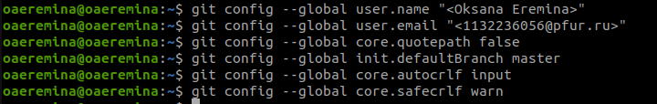{#fig:001 width=70%}

3. Создание SSH ключа

Для идентификации пользователя на сервере репозиториев необходимо сгенерировать ключи (приватный и открытый), для этого ввожу команду, указав имя и электронную почту.

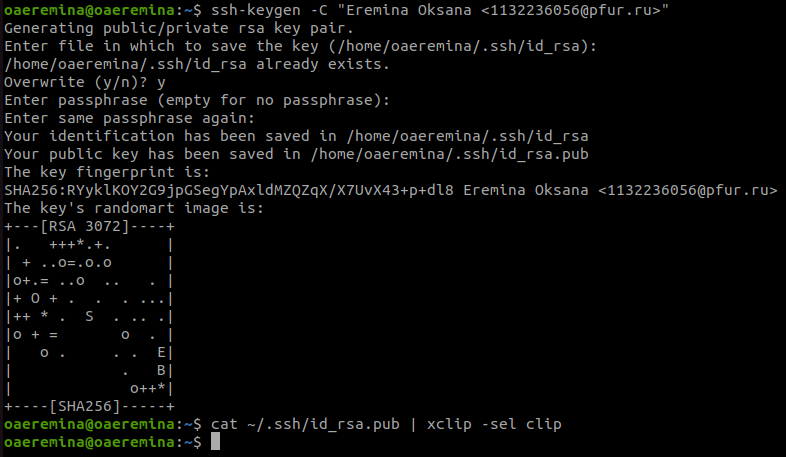{#fig:001 width=70%}

С помощью команды Xclip копирую текст через териминал и вставляю скопированный текст в поле “key” github.

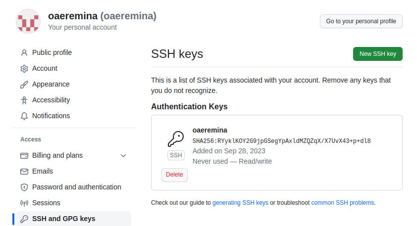{#fig:001 width=70%}

4. Сознание рабочего пространства и репозитория курса на основе шаблона

Создаю директорию с помощью утилиты mkdir

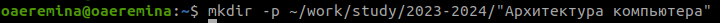{#fig:001 width=70%}

5. Сознание репозитория курса на основе шаблона

Перехожу по ссылке, далее выбираю “Use this template”, чтобы использовать шаблон для своего репозитория 

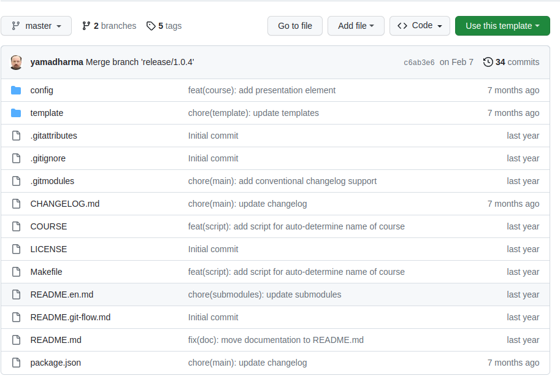{#fig:001 width=70%}

В открывшемся окне задаю имя репозитория : study_2023-2024_arh-pc и создаю репозиторий, нажав на кнопку 

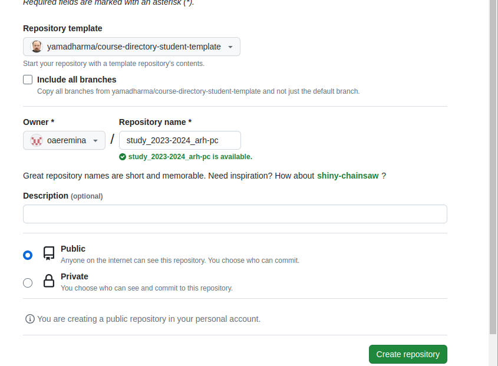{#fig:001 width=70%}

Клонирую созданный репозиторий 

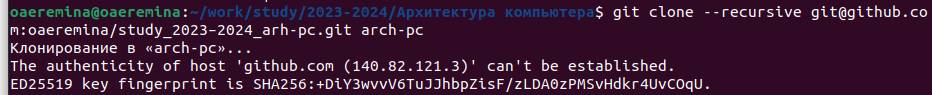{#fig:001 width=70%}

6. Настройка каталога курса

Перехожу в каталог arch-pc с помощью cd,  удаляю лишние файлы и создаю необходимые каталоги
Отправляю созданные каталоги с локального репозитория на сервер: добавляю все созданные каталоги с помощью git add, отправляю все на сервер с помощью push.

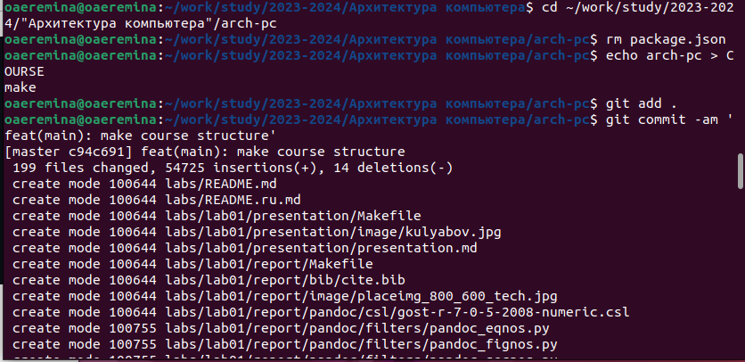{#fig:001 width=70%}

7. Выполнение заданий для самостоятельной работы

Перехожу в директорию labs/lab02/report с помощью утилиты cd. Создаю в каталоге файл для отчета по второй лабораторной работе с помощью утилиты touch

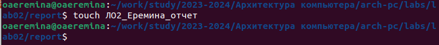{#fig:001 width=70%}

Копирую первую лабораторную работу с помощью cpи проверяю правильность выполнения команды

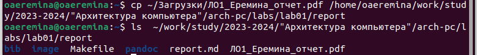{#fig:001 width=70%}

Перехожу в дерикторию, в которой находится отчет по первой лабораторной работе, добавляю файл с помощью git add.

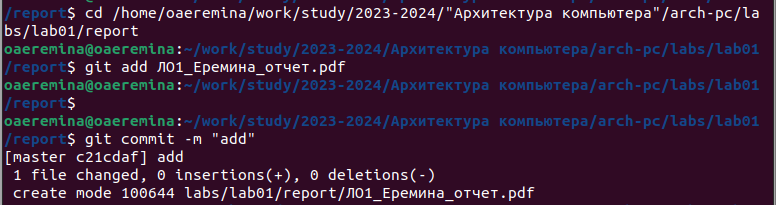{#fig:001 width=70%}

отправляю в центральный репозиторий с помощью команды git push -f origin master

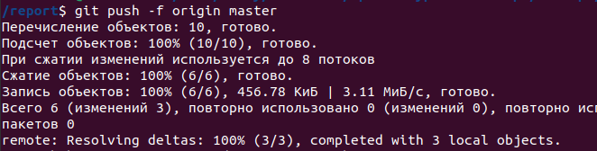{#fig:001 width=70%}

Проверяю правильность выполнения команд

{#fig:001 width=70%}

# Выводы

При выполнении данной лабораторной работы я изучила средств контроля версий, а также приобрела практические навыки по работе с системой git.

# Список литературы{.unnumbered}

Архитектура ЭВМ
