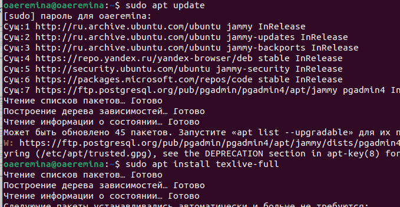
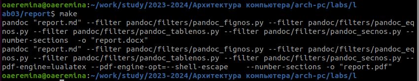
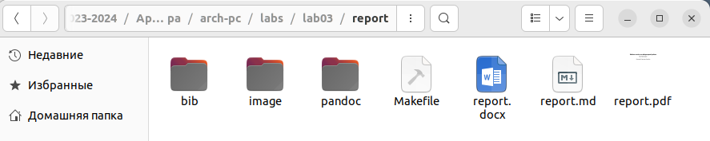
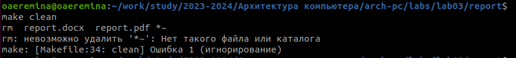
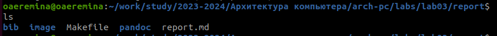

---
## Front matter
title: "Отчёта по лабораторной работе №3"
subtitle: "Дисциплина: Архитектура компьютера"
author: "Еремина Оксана Андреевна"

## Generic otions
lang: ru-RU
toc-title: "Содержание"

## Bibliography
bibliography: bib/cite.bib
csl: pandoc/csl/gost-r-7-0-5-2008-numeric.csl

## Pdf output format
toc: true # Table of contents
toc-depth: 2
lof: true # List of figures
lot: true # List of tables
fontsize: 12pt
linestretch: 1.5
papersize: a4
documentclass: scrreprt
## I18n polyglossia
polyglossia-lang:
  name: russian
  options:
	- spelling=modern
	- babelshorthands=true
polyglossia-otherlangs:
  name: english
## I18n babel
babel-lang: russian
babel-otherlangs: english
## Fonts
mainfont: PT Serif
romanfont: PT Serif
sansfont: PT Sans
monofont: PT Mono
mainfontoptions: Ligatures=TeX
romanfontoptions: Ligatures=TeX
sansfontoptions: Ligatures=TeX,Scale=MatchLowercase
monofontoptions: Scale=MatchLowercase,Scale=0.9
## Biblatex
biblatex: true
biblio-style: "gost-numeric"
biblatexoptions:
  - parentracker=true
  - backend=biber
  - hyperref=auto
  - language=auto
  - autolang=other*
  - citestyle=gost-numeric
## Pandoc-crossref LaTeX customization
figureTitle: "Рис."
tableTitle: "Таблица"
listingTitle: "Листинг"
lofTitle: "Список иллюстраций"
lotTitle: "Список таблиц"
lolTitle: "Листинги"
## Misc options
indent: true
header-includes:
  - \usepackage{indentfirst}
  - \usepackage{float} # keep figures where there are in the text
  - \floatplacement{figure}{H} # keep figures where there are in the text
---

# Цель работы

Целью данной работы является приобретение практических навыков работы с markdown, tex live, pandoc

# Задание

1. Установка необходимого ПО
2. Заполнение отчета по выполнению лабораторной работы №3 с помощью Markdown
3. Задание для самостоятельной работы

# Теоретическое введение

Чтобы задать для текста полужирное начертание, заключите его в двойные звездочки:
This text is **bold**.

Чтобы задать для текста курсивное начертание, заключите его в одинарные звездочки:
This text is *italic*.

Чтобы задать для текста полужирное и курсивное начертание, заключите его в тройные
звездочки:
This is text is both ***bold and italic***.

В Markdown вставить изображение в документ можно с помощью непосредственного
указания адреса изображения. 

# Выполнение лабораторной работы

Для начала я устанавливаю TeX Live, Pandoc (рис.1)

{#fig:001 width=70%}

Открываю терминал, перехожу в каталог курса и обновляю локальный репозиторий. (рис.2)

{#fig:001 width=70%}

Перехожу в каталог lab03 и провожу компиляцию, введя команду make (рис.3)

{#fig:001 width=70%}

Проверяю успешность компиляции (рис.4)

{#fig:001 width=70%}

С помощью команды make clean удаляю файлы (рис.5) 

{#fig:001 width=70%}

проверяю это через команду ls (рис.6)

{#fig:001 width=70%}

# Выводы

При выполнении данной лабораторной работы я приобрела практические навыки по работе с markdown, TeXLive и pandoc

# Список литературы{.unnumbered}

Архитектура ЭВМ
