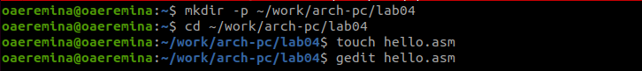
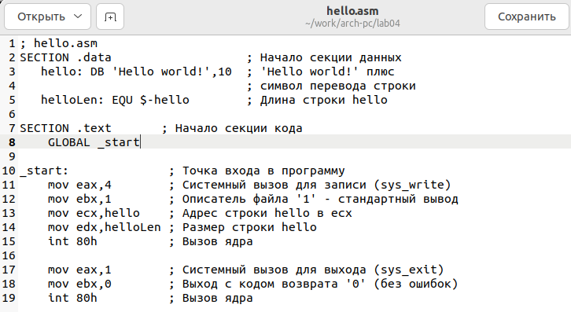
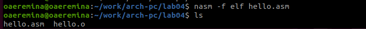
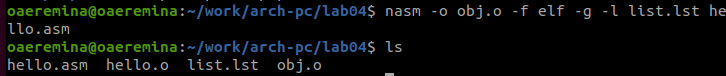
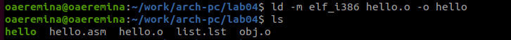
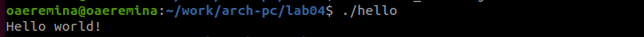
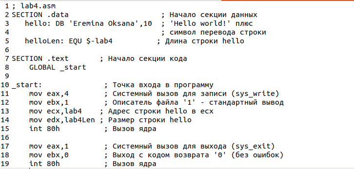
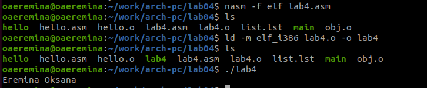

---
## Front matter
title: "Отчёта по лабораторной работе №4"
subtitle: "Архитектура компьютера"
author: "Еремина Оксана Андреевна НКАбд-02-23"

## Generic otions
lang: ru-RU
toc-title: "Содержание"

## Bibliography
bibliography: bib/cite.bib
csl: pandoc/csl/gost-r-7-0-5-2008-numeric.csl

## Pdf output format
toc: true # Table of contents
toc-depth: 2
lof: true # List of figures
lot: true # List of tables
fontsize: 12pt
linestretch: 1.5
papersize: a4
documentclass: scrreprt
## I18n polyglossia
polyglossia-lang:
  name: russian
  options:
	- spelling=modern
	- babelshorthands=true
polyglossia-otherlangs:
  name: english
## I18n babel
babel-lang: russian
babel-otherlangs: english
## Fonts
mainfont: PT Serif
romanfont: PT Serif
sansfont: PT Sans
monofont: PT Mono
mainfontoptions: Ligatures=TeX
romanfontoptions: Ligatures=TeX
sansfontoptions: Ligatures=TeX,Scale=MatchLowercase
monofontoptions: Scale=MatchLowercase,Scale=0.9
## Biblatex
biblatex: true
biblio-style: "gost-numeric"
biblatexoptions:
  - parentracker=true
  - backend=biber
  - hyperref=auto
  - language=auto
  - autolang=other*
  - citestyle=gost-numeric
## Pandoc-crossref LaTeX customization
figureTitle: "Рис."
tableTitle: "Таблица"
listingTitle: "Листинг"
lofTitle: "Список иллюстраций"
lotTitle: "Список таблиц"
lolTitle: "Листинги"
## Misc options
indent: true
header-includes:
  - \usepackage{indentfirst}
  - \usepackage{float} # keep figures where there are in the text
  - \floatplacement{figure}{H} # keep figures where there are in the text
---

# Цель работы

Освоение процедуры компиляции и сборки программ, написанных на ассемблере NASM

# Задание

4.3.1. Программа Hello world!
4.3.2. Транслятор NASM
4.3.3. Расширенный синтаксис командной строки NASM
4.4. Компоновщик LD
4.4.1. Запуск исполняемого файла
4.5. Задание для самостоятельной работы

# Теоретическое введение

Основными функциональными элементами любой электронно-вычислительной машины
(ЭВМ) являются центральный процессор, память и периферийные устройства.

Язык ассемблера (assembly language, сокращённо asm) — машинно-ориентированный
язык низкого уровня. Можно считать, что он больше любых других языков приближен к
архитектуре ЭВМ и её аппаратным возможностям, что позволяет получить к ним более
полный доступ, нежели в языках высокого уровня,таких как C/C++, Perl, Python и пр.

# Выполнение лабораторной работы

4.3.1. Программа Hello world!

Создаю каталог для работы на языке ассемблера NASM, перехожу в него и создаю текстовый файл, открываю текстовый файл с помощью текстового редактора (рис.1)

{#fig:001 width=70%}

Ввожу текст для вывода приветственного сообщения. (рис.2)

{#fig:001 width=70%}

4.3.2. Транслятор NASM

С помощью команды превращаю текст программы в объектный код, и проверяю наличие, появившегося файла с помощью команды ls 

{#fig:001 width=70%}

4.3.3. Расширенный синтаксис командной строки NASM

С помощью команды компелирую файл hello.asm в obj.o и проверяю, что файлы создались (рис.4)

{#fig:001 width=70%}

4.4. Компоновщик LD

Передаю объектный файл на обрабодку компоновщику и проверяю, что файл был создан (рис.5)

{#fig:001 width=70%}

4.4.1. Запуск исполняемого файла

Запускаю файл и смотрю, что он выведет в терминале (рис.6)

{#fig:001 width=70%}

4.5. Задание для самостоятельной работы

С помощью ср создаю копию файла hello.asm с именем lab4.asm(рис.7)

{#fig:001 width=70%}

Открываю файл в текстовом редакторе и вношу изменения в программу так, чтобы она выводила мои имя и фамилию (рис.8)

{#fig:001 width=70%}

Компилирую текст программы в объектный файл, проверяю, чтофайл создан.
Передаю объектный файл на обработку компоновщику и запускаю программу (рис.9)

{#fig:001 width=70%}
# Выводы

При выполнении данной лабораторной работы я освоила процедуры компиляции и сборки программ, написанных на ассемблере NASM.

# Список литературы{.unnumbered}

Архитектура ЭВМ
