---
## Front matter
title: "Отчёта по лабораторной работе №5"
subtitle: "Архитектура компьютера"
author: "Еремина Оксана Андреевна НКАбд-02-23"

## Generic otions
lang: ru-RU
toc-title: "Содержание"

## Bibliography
bibliography: bib/cite.bib
csl: pandoc/csl/gost-r-7-0-5-2008-numeric.csl

## Pdf output format
toc: true # Table of contents
toc-depth: 2
lof: true # List of figures
lot: true # List of tables
fontsize: 12pt
linestretch: 1.5
papersize: a4
documentclass: scrreprt
## I18n polyglossia
polyglossia-lang:
  name: russian
  options:
	- spelling=modern
	- babelshorthands=true
polyglossia-otherlangs:
  name: english
## I18n babel
babel-lang: russian
babel-otherlangs: english
## Fonts
mainfont: PT Serif
romanfont: PT Serif
sansfont: PT Sans
monofont: PT Mono
mainfontoptions: Ligatures=TeX
romanfontoptions: Ligatures=TeX
sansfontoptions: Ligatures=TeX,Scale=MatchLowercase
monofontoptions: Scale=MatchLowercase,Scale=0.9
## Biblatex
biblatex: true
biblio-style: "gost-numeric"
biblatexoptions:
  - parentracker=true
  - backend=biber
  - hyperref=auto
  - language=auto
  - autolang=other*
  - citestyle=gost-numeric
## Pandoc-crossref LaTeX customization
figureTitle: "Рис."
tableTitle: "Таблица"
listingTitle: "Листинг"
lofTitle: "Список иллюстраций"
lotTitle: "Список таблиц"
lolTitle: "Листинги"
## Misc options
indent: true
header-includes:
  - \usepackage{indentfirst}
  - \usepackage{float} # keep figures where there are in the text
  - \floatplacement{figure}{H} # keep figures where there are in the text
---

# Цель работы

Целью данной лабораторной работы является приобретение практических навыков работы в Midnight Commander, освоение инструкций языка ассемблера mov и int.

# Задание

1. Основы работы с mc
2. Структура программы на языке ассемблера NASM
3. Подключение внешнего файла
4. Выполнение заданий для самостоятельной работы

# Теоретическое введение

Midnight Commander (или просто mc) — это программа, которая позволяет просматривать структуру каталогов и выполнять основные операции по управлению файловой системой, т.е. mc является файловым менеджером. Midnight Commander позволяет сделать работу с файлами более удобной и наглядной.

Программа на языке ассемблера NASM, как правило, состоит из трёх секций: секция кода программы (SECTION .text), секция инициированных (известных во время компиляции) данных (SECTION .data) и секция неинициализированных данных (тех, под которые во время компиляции только отводится память, а значение присваивается в ходе выполнения программы) (SECTION .bss).

# Выполнение лабораторной работы

1. Основы работы с mc

Открываю терминал, ввожу команду mc и создаю папку lab05 (рис1)

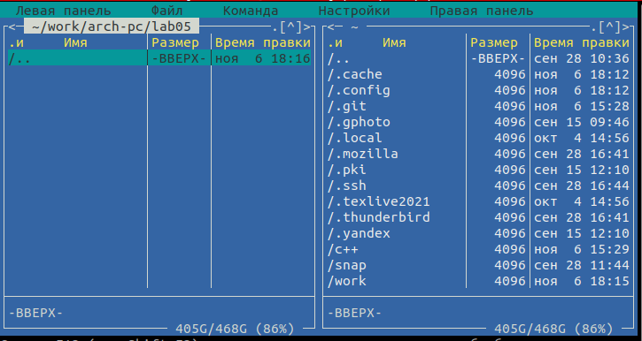{#fig:001 width=70%}

С помощью команды touch создаю файл lab5-1.asm (рис2)

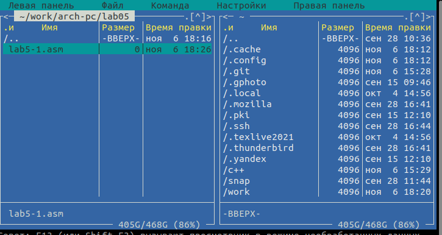{#fig:001 width=70%}

2. Структура программы на языке ассемблера NASM

С помощью клавиши F4 открываю созданный файл. Ввожу в файл код программы для запроса строки у пользователя. (рис3)

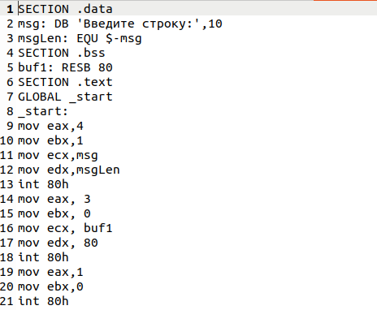{#fig:001 width=70%}

Транслирую текст программы файла в объектный файл командой nasm -f elf lab5-1.asm. 
Выполняю компоновку объектного файла с помощью команды ld -m elf_i386 -o lab5-1 lab5-1.o.
Далее запускаю файл командой $ ./lab5-1 (рис4)

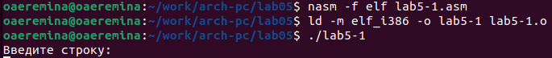{#fig:001 width=70%}

Программа выводитстроку "Введите строку:", я ввожу свои ФИО, на этом программа заканчивает свою работу (рис5)

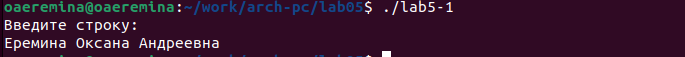{#fig:001 width=70%}

3. Подключение внешнего файла 

Скачиваю файл in_out.asm со страницы курса в ТУИС, он сохранился в каталоге Загрузки. С помощью клавишиши F5 копирую файл из каталога загрузки в каталог lab05 (рис6)

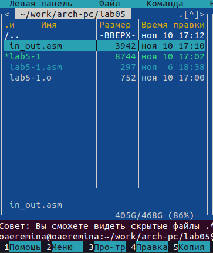{#fig:001 width=70%}

С помощью клавиши F5 копирую файл lab5-1 в тотже каталог, с названием lab5-2 и проверяю это (рис7)

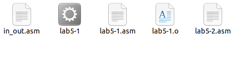{#fig:001 width=70%}

Изменяю содержимое файла lab5-2.asm в текстовом редакторе, чтобы в программе использовались подпрограммы из внешнего файла in_out.asm. (рис8)

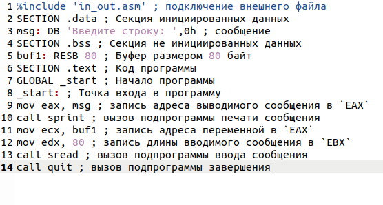{#fig:001 width=70%}

Транслирую текст программы файла в объектный файл командой nasm -f elf lab5-2.asm. 
Выполняю компоновку объектного файла с помощью команды ld -m elf_i386 -o lab5-2 lab5-2.o.
Далее запускаю файл командой $ ./lab5-2 (рис9)

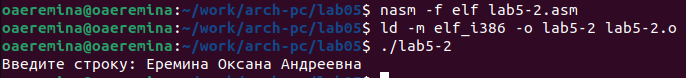{#fig:001 width=70%}

Разница меду первым исполняемым файлом и вторым в том, что запуск первого запрашивает ввод с новой строки, в то время как при запуске второго, запрашивается ввод без переноса на новую строку.

4. Выполнение заданий для самостоятельной работы 

Создаю копию файла lab5-1.asm, открываю созданный файл и изменяю программу (рис10)

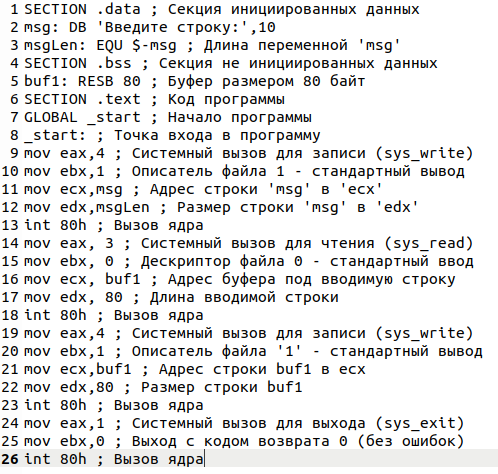{#fig:001 width=70%}

Создаю объектый файл lab5-1-1.0, получаю исполняемый файл lab5-1-1, отдав его на обработку компоновщику, запускаю файл. Программа запрашивает ввод, ввожу ФИО, далее программа выводит введеные данные (рис11)

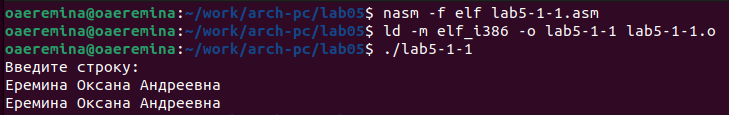{#fig:001 width=70%}

Создаю копию файла lab5-2.asm, открываю созданный файл и изменяю программу (рис12)

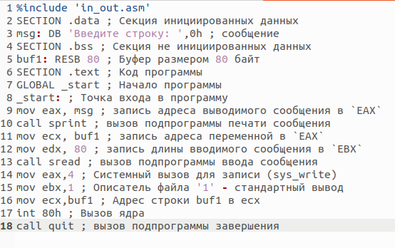{#fig:001 width=70%}

Создаю объектый файл lab5-2-1.0, получаю исполняемый файл lab5-2-1, отдав его на обработку компоновщику, запускаю файл. Программа запрашивает ввод, ввожу ФИО, далее программа выводит введеные данные (рис13)

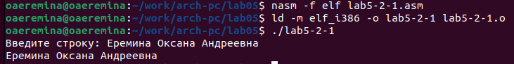{#fig:001 width=70%}

# Выводы

При выполнении данной лабораторной работы я приобрела практические навыки работы в Midnight Commander, а также освоила инструкции языка ассемблера mov и int.

# Список литературы{.unnumbered}

Архитектура ЭВМ
