---
## Front matter
title: "Отчёта по лабораторной работе №6"
subtitle: "Архитектура компьютера"
author: "Еремина Оксана Андреевна НКАбд-02-23"

## Generic otions
lang: ru-RU
toc-title: "Содержание"

## Bibliography
bibliography: bib/cite.bib
csl: pandoc/csl/gost-r-7-0-5-2008-numeric.csl

## Pdf output format
toc: true # Table of contents
toc-depth: 2
lof: true # List of figures
lot: true # List of tables
fontsize: 12pt
linestretch: 1.5
papersize: a4
documentclass: scrreprt
## I18n polyglossia
polyglossia-lang:
  name: russian
  options:
	- spelling=modern
	- babelshorthands=true
polyglossia-otherlangs:
  name: english
## I18n babel
babel-lang: russian
babel-otherlangs: english
## Fonts
mainfont: PT Serif
romanfont: PT Serif
sansfont: PT Sans
monofont: PT Mono
mainfontoptions: Ligatures=TeX
romanfontoptions: Ligatures=TeX
sansfontoptions: Ligatures=TeX,Scale=MatchLowercase
monofontoptions: Scale=MatchLowercase,Scale=0.9
## Biblatex
biblatex: true
biblio-style: "gost-numeric"
biblatexoptions:
  - parentracker=true
  - backend=biber
  - hyperref=auto
  - language=auto
  - autolang=other*
  - citestyle=gost-numeric
## Pandoc-crossref LaTeX customization
figureTitle: "Рис."
tableTitle: "Таблица"
listingTitle: "Листинг"
lofTitle: "Список иллюстраций"
lotTitle: "Список таблиц"
lolTitle: "Листинги"
## Misc options
indent: true
header-includes:
  - \usepackage{indentfirst}
  - \usepackage{float} # keep figures where there are in the text
  - \floatplacement{figure}{H} # keep figures where there are in the text
---

# Цель работы

Целью данной лабораторной работы является освоение арифметческих инструкций языка ассемблера NASM.

# Задание

1. Символьные и численные данные в NASM
2. Выполнение арифметических операций в NASM
3. Выполнение заданий для самостоятельной работы

# Теоретическое введение

Большинство инструкций на языке ассемблера требуют обработки операндов. Адрес операнда предоставляет место, где хранятся данные, подлежащие обработке. Это могут быть данные хранящиеся в регистре или в ячейке памяти. Далее рассмотрены все существующие способы задания адреса хранения операндов – способы адресации.
Существует три основных способа адресации:
• Регистровая адресация – операнды хранятся в регистрах и в команде используются имена этих регистров, например: mov ax,bx.
• Непосредственная адресация – значение операнда задается непосредственно в команде, Например: mov ax,2.
• Адресация памяти – операнд задает адрес в памяти. В команде указывается символическое обозначение ячейки памяти, над содержимым которой требуется выполнить операцию.

Ввод информации с клавиатуры и вывод её на экран осуществляется в символьном виде. Кодирование этой информации производится согласно кодовой таблице символов ASCII. ASCII – сокращение от American Standard Code for Information Interchange (Американский стандартный код для обмена информацией). Согласно стандарту ASCII каждый символ кодируется одним байтом.

# Выполнение лабораторной работы

1. Символьные и численные данные в NASM

Создаю каталог для программы данной лабораторной работы, и в нем создаю файл lab6-1.asm. И проверяю правильность выполнения команд.(рис.1)

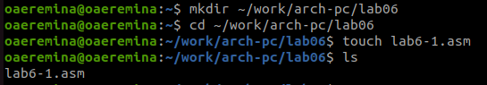{#fig:001 width=70%}

Копирую в созданный каталог файл in_out.asm, т.к. он будет использоваться далее. (рис.2)

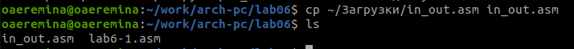{#fig:001 width=70%}

Открываю созданный файл, вставляю в него программу вывода значения регистра eax. (рис.3)

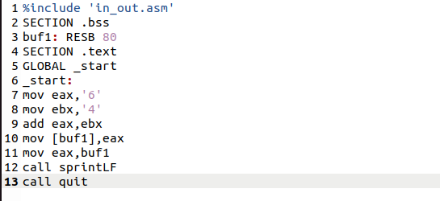{#fig:001 width=70%}

Создаю исполняемый файл и запускаю его (рис.4)

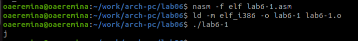{#fig:001 width=70%}

Изменяю в тексте программы символы '6' и '4' на 6 и 4 (рис.5)

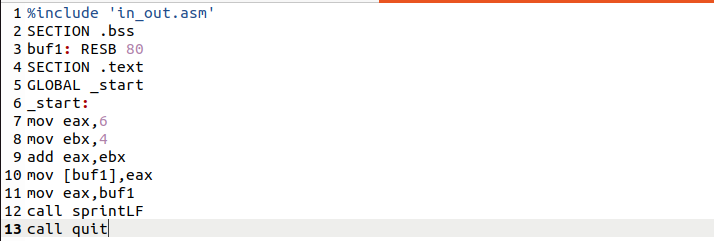{#fig:001 width=70%}

Создаю исполняемый файл программы и запускаю его. Вывелся символ с кодом 10 -символ перевода строки, он не отображается на экране при выводе (рис.6)

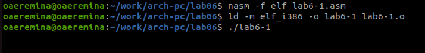{#fig:001 width=70%}

Создаю новый файл с помощью touch (рис.7)

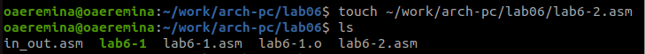{#fig:001 width=70%}

Открываю созданный файл, вставляю в него текст другой программы для вывода значения регистра eax. (рис.8)

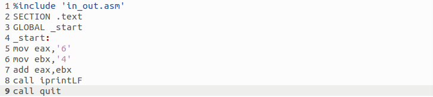{#fig:001 width=70%}

Создаю и запускаю исполняемый файл lab7-2 (рис.9). Теперь программа выводит число 106, потому что программа позволяет вывести именно число, а не символ, однако происходит именно сложение кодов символов “6” и “4”.

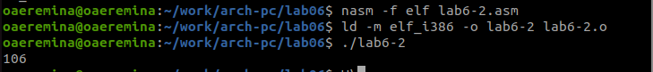{#fig:001 width=70%}

Изменяю в тексте программы символы '6' и '4' на 6 и 4 (рис.10)

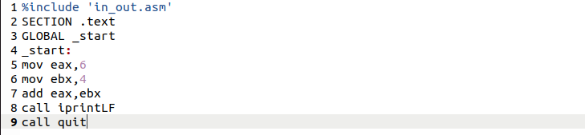{#fig:001 width=70%}

Создаю и запускаю исполняемый файл (рис.11)

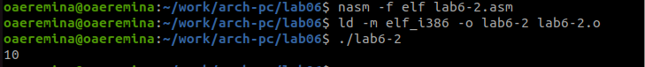{#fig:001 width=70%}

Заменяю в тексте программы функцию iprintLF на iprint (рис.12)

{#fig:001 width=70%}

Создаю и запускаю новый исполняемый файл (рис.13).Вывод не изменится, потому что символ переноса строки не отображался, когда программа исполнялась с функцией iprintLF, а iprint не добавляет к выводу символ переноса строки, в отличие от iprintLF.

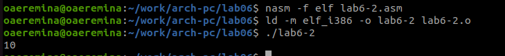{#fig:001 width=70%}

2. Выполнение арифметических операций в NASM

Создаю файл lab6-3.asm с помощью touch (рис.14)

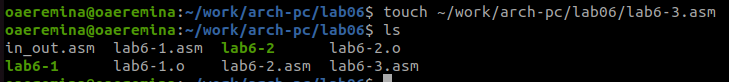{#fig:001 width=70%}

Ввожу в созданный файл текст программы для вычисления значения выражения f(x) = (5 * 2 + 3)/3 (рис.15)

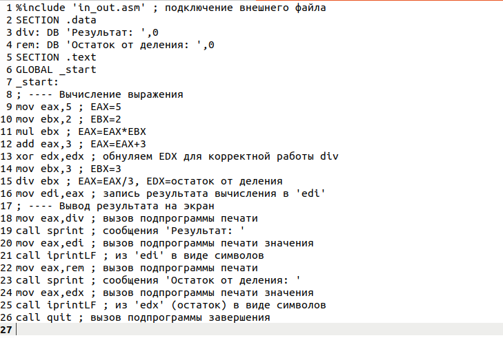{#fig:001 width=70%}

Создаю и запускаю новый исполняемый файл (рис.16)

{#fig:001 width=70%}

Изменяю текст программу для вычисления значения выражения f(x) = (4 * 6 + 2)/5 (рис.17)

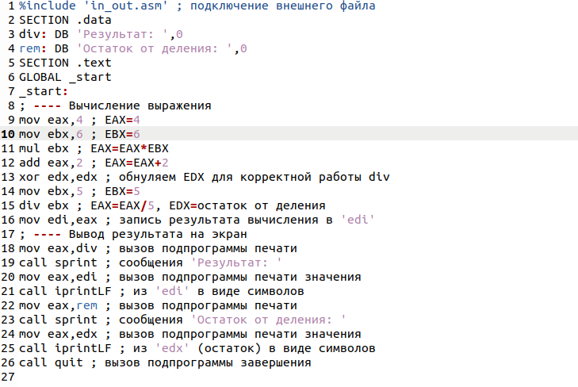{#fig:001 width=70%}

Создаю и запускаю новый исполняемый файл (рис.18)

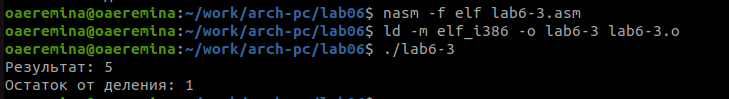{#fig:001 width=70%}

Создаю файл variant.asm с помощью touch (рис.19)

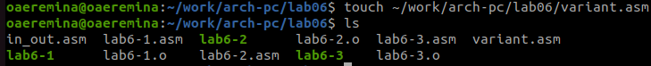{#fig:001 width=70%}

Ввожу в файл текст программы для вычисления варианта задания по номеру студенческого билета (рис.20)

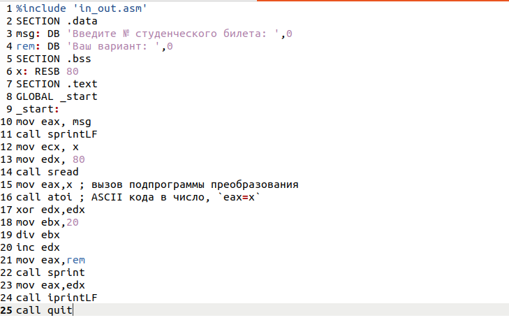{#fig:001 width=70%}

Создаю и запускаю исполняемый файл (рис.21). Ввожу номер своего студенческого билета, программа вывела, что мой вариант - 17.

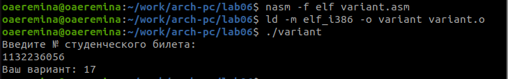{#fig:001 width=70%}

Ответы на вопросы: 

1. Какие строки листинга 6.4 отвечают за вывод на экран сообщения ‘Ваш вариант:’?

За вывод сообщения “Ваш вариант” отвечают строки кода:
mov eax,rem
call sprint

2. Для чего используется следующие инструкции?
mov ecx, x
mov edx, 80
call sread

Инструкция mov ecx, x используется, чтобы положить адрес вводимой строки x в регистр ecx mov edx, 80 - запись в регистр edx длины вводимой строки call sread - вызов подпрограммы из внешнего файла, обеспечивающей ввод сообщения с клавиатуры

3. Для чего используется инструкция “call atoi”?

call atoi используется для вызова подпрограммы из внешнего файла, которая преобразует ascii-код символа в целое число и записывает результат в регистр eax

4. Какие строки листинга 6.4 отвечают за вычисления варианта?

За вычисления варианта отвечают строки:
xor edx,edx
mov ebx,20
div ebx
inc edx

5. В какой регистр записывается остаток от деления при выполнении инструкции “div ebx”?

При выполнении инструкции div ebx остаток от деления записывается в регистр edx

6. Для чего используется инструкция “inc edx”?

Инструкция inc edx увеличивает значение регистра edx на 1

7. Какие строки листинга 6.4 отвечают за вывод на экран результата вычислений?

За вывод на экран результатов вычислений отвечают строки:
mov eax,edx
call iprintLF

3. Выполнение заданий для самостоятельной работы

Создаю файл lab6-4.asm с помощью touch. Открываю созданный файл, ввожу текст программы для вычисления значения выражения (11 + x) * 2 - 6. Выражение под вариантном 8. (рис. 22)

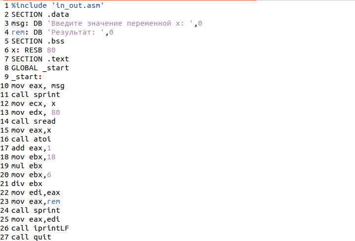{#fig:001 width=70%}

Создаю и запускаю исполняемый файл. При вводе значения 2, программа выводит 20. (рис. 23)
# Вывод
При выполнении данной лабораторной работы я освоила арифметические инструкции языка ассемблера NASM.

# Список литературы{.unnumbered}

Архитектура ЭВМ
