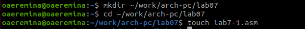
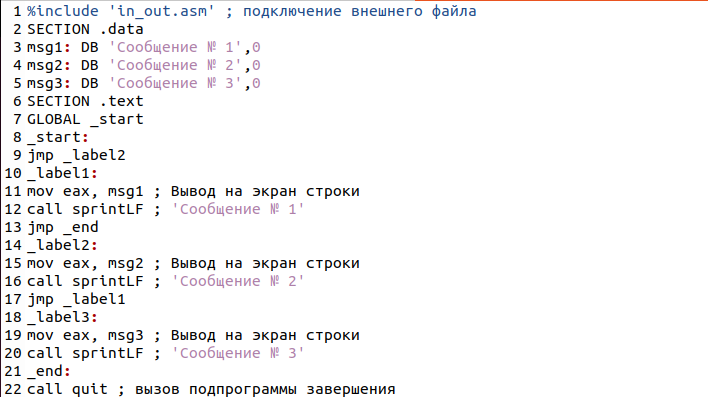
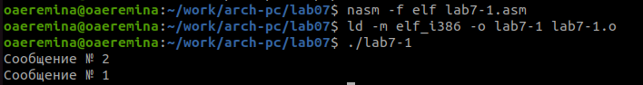

---
## Front matter
title: "Отчёта по лабораторной работе №7"
subtitle: "Архитектура компьютера"
author: "Еремина Оксана Андреевна НКАбд-02-23"

## Generic otions
lang: ru-RU
toc-title: "Содержание"

## Bibliography
bibliography: bib/cite.bib
csl: pandoc/csl/gost-r-7-0-5-2008-numeric.csl

## Pdf output format
toc: true # Table of contents
toc-depth: 2
lof: true # List of figures
lot: true # List of tables
fontsize: 12pt
linestretch: 1.5
papersize: a4
documentclass: scrreprt
## I18n polyglossia
polyglossia-lang:
  name: russian
  options:
	- spelling=modern
	- babelshorthands=true
polyglossia-otherlangs:
  name: english
## I18n babel
babel-lang: russian
babel-otherlangs: english
## Fonts
mainfont: PT Serif
romanfont: PT Serif
sansfont: PT Sans
monofont: PT Mono
mainfontoptions: Ligatures=TeX
romanfontoptions: Ligatures=TeX
sansfontoptions: Ligatures=TeX,Scale=MatchLowercase
monofontoptions: Scale=MatchLowercase,Scale=0.9
## Biblatex
biblatex: true
biblio-style: "gost-numeric"
biblatexoptions:
  - parentracker=true
  - backend=biber
  - hyperref=auto
  - language=auto
  - autolang=other*
  - citestyle=gost-numeric
## Pandoc-crossref LaTeX customization
figureTitle: "Рис."
tableTitle: "Таблица"
listingTitle: "Листинг"
lofTitle: "Список иллюстраций"
lotTitle: "Список таблиц"
lolTitle: "Листинги"
## Misc options
indent: true
header-includes:
  - \usepackage{indentfirst}
  - \usepackage{float} # keep figures where there are in the text
  - \floatplacement{figure}{H} # keep figures where there are in the text
---

# Цель работы

Целью данной лабораторной работы является освоение арифметческих инструкций языка ассемблера NASM.

# Задание

1. Реализация переходов в NASM
2. Изучение структуры файлы листинга
3. Выполнение заданий для самостоятельной работы

# Теоретическое введение

Для реализации ветвлений в ассемблере используются так называемые команды передачи
управления или команды перехода. Можно выделить 2 типа переходов:
• условный переход – выполнение или не выполнение перехода в определенную точку
программы в зависимости от проверки условия.
• безусловный переход – выполнение передачи управления в определенную точку программы без каких-либо условий.

Флаг – это бит, принимающий значение 1 («флаг установлен»), если выполнено некоторое
условие, и значение 0 («флаг сброшен») в противном случае. Флаги работают независимо
друг от друга, и лишь для удобства они помещены в единый регистр — регистр флагов, отражающий текущее состояние процессора

Листинг (в рамках понятийного аппарата NASM) — это один из выходных файлов, создаваемых транслятором. Он имеет текстовый вид и нужен при отладке программы, так как
кроме строк самой программы он содержит дополнительную информацию.

# Выполнение лабораторной работы

1. Реализация переходов в NASM

Создаю каталог для программам лабораторной работы № 7, перехожу в него и создаю файл lab7-1.asm. (рис.1)

{#fig:001 width=70%}

Ввожу в файл lab7-1.asm текст программы. (рис.2)

{#fig:001 width=70%}

Создаю исполняемый файл и проверяю работу программы. (рис.3)

{#fig:001 width=70%}

Изменяю код программы так, чтобы она сначала выводила ‘Сообщение № 2’, потом ‘Сообщение
№ 1’ и завершала работу. (рис.4)

{#fig:001 width=70%}

Создаю исполняемый файл и проверяю работу программы. (рис.5)

{#fig:001 width=70%}

Изменяю код программы так, чтобы она сначала выводила ‘Сообщение № 3’, потом ‘Сообщение
№ 2’, ‘Сообщение № 1’ и завершала работу. (рис.6)

{#fig:001 width=70%}

Создаю исполняемый файл и проверяю работу программы. (рис.7)

{#fig:001 width=70%}

Создаю файл lab7-2.asm в каталоге ~/work/arch-pc/lab07. Ввожу код программы в созданный файл. (рис.8)

{#fig:001 width=70%}

Создаю исполняемый файл и провяю его работу для разных значений B (1; 5). (рис.9)

{#fig:001 width=70%}

2. Изучение структуры файлы листинга

Создаю файл листинга для программы из файла lab7-2.asm, знакамлюсь с его форматом и содержимым файла листинга, она показан ниже. (рис.10)

{#fig:001 width=70%}

3. Выполнение заданий для самостоятельной работы

# Вывод

При выполнении данной лабораторной работы я изучила команды условного и безусловного перехода, приобрела навык написания программ с использованием переходов и познакомилась с назначением и структурой файла листинга. 

# Список литературы{.unnumbered}

Архитектура ЭВМ
