---
## Front matter
title: "Отчёта по лабораторной работе №8"
subtitle: "Архитектура компьютера"
author: "Еремина Оксана Андреевна НКАбд-02-23"

## Generic otions
lang: ru-RU
toc-title: "Содержание"

## Bibliography
bibliography: bib/cite.bib
csl: pandoc/csl/gost-r-7-0-5-2008-numeric.csl

## Pdf output format
toc: true # Table of contents
toc-depth: 2
lof: true # List of figures
lot: true # List of tables
fontsize: 12pt
linestretch: 1.5
papersize: a4
documentclass: scrreprt
## I18n polyglossia
polyglossia-lang:
  name: russian
  options:
	- spelling=modern
	- babelshorthands=true
polyglossia-otherlangs:
  name: english
## I18n babel
babel-lang: russian
babel-otherlangs: english
## Fonts
mainfont: PT Serif
romanfont: PT Serif
sansfont: PT Sans
monofont: PT Mono
mainfontoptions: Ligatures=TeX
romanfontoptions: Ligatures=TeX
sansfontoptions: Ligatures=TeX,Scale=MatchLowercase
monofontoptions: Scale=MatchLowercase,Scale=0.9
## Biblatex
biblatex: true
biblio-style: "gost-numeric"
biblatexoptions:
  - parentracker=true
  - backend=biber
  - hyperref=auto
  - language=auto
  - autolang=other*
  - citestyle=gost-numeric
## Pandoc-crossref LaTeX customization
figureTitle: "Рис."
tableTitle: "Таблица"
listingTitle: "Листинг"
lofTitle: "Список иллюстраций"
lotTitle: "Список таблиц"
lolTitle: "Листинги"
## Misc options
indent: true
header-includes:
  - \usepackage{indentfirst}
  - \usepackage{float} # keep figures where there are in the text
  - \floatplacement{figure}{H} # keep figures where there are in the text
---

# Цель работы

Целью данной лабораторной работы является приобретение навыков написания программ с использованием циклов и обработкой аргументов командной строки.

# Задание

1. Реализация циклов в NASM
2. Обработка аргументов командной строки
3. Выполнение заданий для самостоятельной работы

# Теоретическое введение

Стек — это структура данных, организованная по принципу LIFO («Last In — First Out»
или «последним пришёл — первым ушёл»). Стек является частью архитектуры процессора и
реализован на аппаратном уровне. Для работы со стеком в процессоре есть специальные
регистры (ss, bp, sp) и команды.

Команда push размещает значение в стеке, т.е. помещает значение в ячейку памяти, на
которую указывает регистр esp, после этого значение регистра esp увеличивается на 4.
Данная команда имеет один операнд — значение, которое необходимо поместить в стек

Для организации циклов существуют специальные инструкции. Для всех инструкций
максимальное количество проходов задаётся в регистре ecx. Наиболее простой является инструкция loop.

# Выполнение лабораторной работы

1. Реализация циклов в NASM

Создаю каталог для программам лабораторной работы № 8, перехожу в него и создаю файл lab8-1.asm. (рис.1)

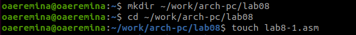{#fig:001 width=70%}

Ввожу в файл lab8-1.asm текст программы. (рис.2)

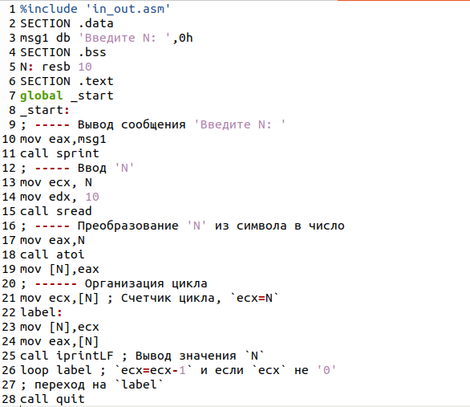{#fig:001 width=70%}

Создаю исполняемый файл и проверяю работу программы. (рис.3)

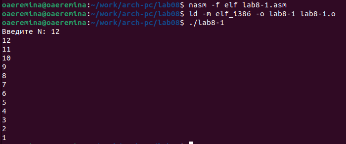{#fig:001 width=70%}

Изменяю код программы, добавив изменение значение регистра ecx в цикле. (рис.4)

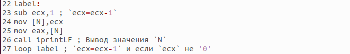{#fig:001 width=70%}

Создаю исполняемый файл и проверяю работу программы. (рис.5) 
Можно заметить, что в первом случае программа уменьшала значения на 1, начиная с вводимого числа (в моем случае 12), во втором же случае на 2 (пропуская вводимое число).

{#fig:001 width=70%}

Изменяю код программы, добавив команды push и pop (добавления в стек и извлечения из стека) для сохранения значения счетчика цикла loop (рис.6)

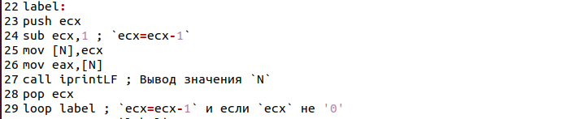{#fig:001 width=70%}

Создаю исполняемый файл и проверяю работу программы. (рис.7) Программа уменьшает значения на 1, пропуская вводимое с клавиатуры число.

{#fig:001 width=70%}

2. Обработка аргументов командной строки

Создаю файл lab8-2.asm в каталоге ~/work/arch-pc/lab08. Ввожу код программы в созданный файл. (рис.8)

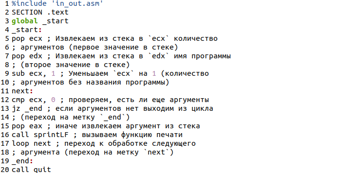{#fig:001 width=70%}

Создаю исполняемый файл и провяю его работу для разных аргументов. (рис.9). Программа обработала все аргументы.

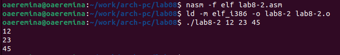{#fig:001 width=70%}

Создаю файл lab8-3.asm в каталоге ~/work/arch-pc/lab08. Ввожу код программы в созданный файл. (рис.10)

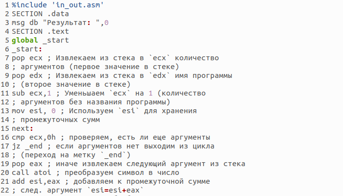{#fig:001 width=70%}

Создаю исполняемый файл и провяю его работу. (рис.11). Программа обработала и сложила все аргументы.

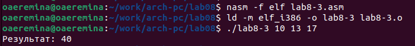{#fig:001 width=70%}

Изменяю программу так, чтобы она умножала, а не складывала аргументы. (рис.12)

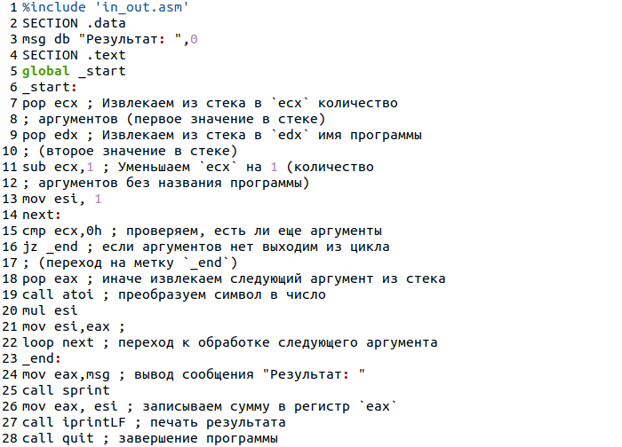{#fig:001 width=70%}

Создаю исполняемый файл и провяю его работу. (рис.13). Программа обработала и умножила все аргументы.

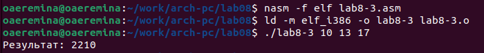{#fig:001 width=70%}

3. Выполнение заданий для самостоятельной работы

Пишу программу которая находит сумму значений функции 𝑓(𝑥) для 𝑥 = 𝑥1, 𝑥2, ..., 𝑥𝑛, т.е. программа должна выводить значение 𝑓(𝑥1) + 𝑓(𝑥2) + ... + 𝑓(𝑥𝑛).Значения переменных выбираю из табл. 8.1. Мой вариант под номером 17, поэтому мой вариант: 10(𝑥 − 1).(рис.14)

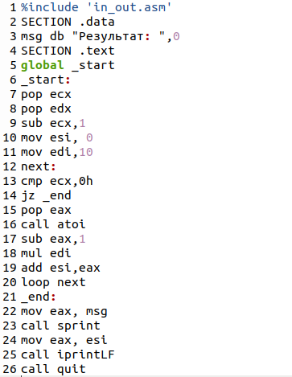{#fig:001 width=70%}

Создаю исполняемый файл и проверяю работу программы, вводя разные значения (рис.15) 

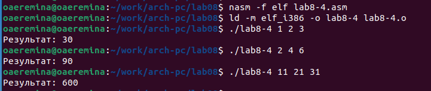{#fig:001 width=70%}

Код программы: 

%include 'in_out.asm'

SECTION .data

msg db "Результат: ",0

SECTION .text

global _start

_start:

pop ecx

pop edx

sub ecx,1

mov esi, 0

mov edi,10

next:

cmp ecx,0h

jz _end

pop eax

call atoi

sub eax,1

mul edi

add esi,eax

loop next

_end:

mov eax, msg

call sprint

mov eax, esi

call iprintLF

call quit

# Вывод

При выполнении данной лабораторной работы я приобрела практические навыки написания программ использованием циклов и обработкой аргументов командной строки.

# Список литературы{.unnumbered}

Архитектура ЭВМ
