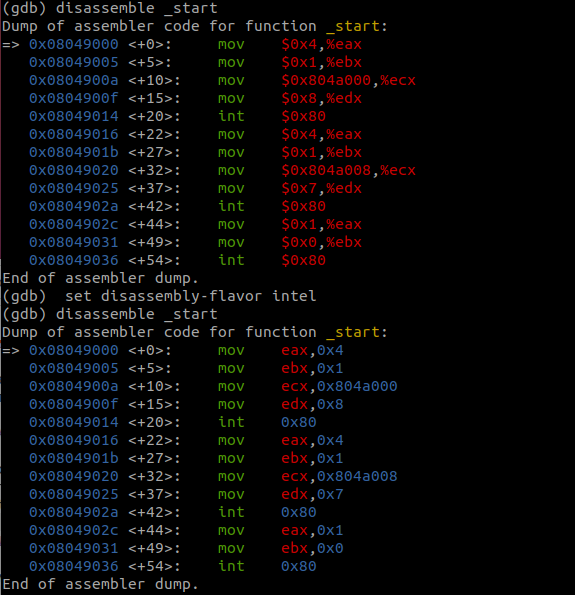
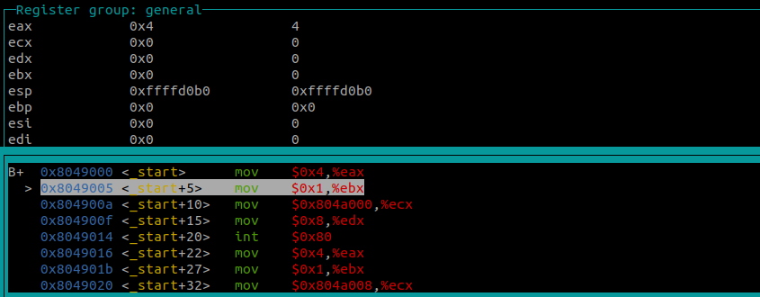

---
## Front matter
title: "Отчёта по лабораторной работе №9"
subtitle: "Архитектура компьютера"
author: "Еремина Оксана Андреевна НКАбд-02-23"

## Generic otions
lang: ru-RU
toc-title: "Содержание"

## Bibliography
bibliography: bib/cite.bib
csl: pandoc/csl/gost-r-7-0-5-2008-numeric.csl

## Pdf output format
toc: true # Table of contents
toc-depth: 2
lof: true # List of figures
lot: true # List of tables
fontsize: 12pt
linestretch: 1.5
papersize: a4
documentclass: scrreprt
## I18n polyglossia
polyglossia-lang:
  name: russian
  options:
	- spelling=modern
	- babelshorthands=true
polyglossia-otherlangs:
  name: english
## I18n babel
babel-lang: russian
babel-otherlangs: english
## Fonts
mainfont: PT Serif
romanfont: PT Serif
sansfont: PT Sans
monofont: PT Mono
mainfontoptions: Ligatures=TeX
romanfontoptions: Ligatures=TeX
sansfontoptions: Ligatures=TeX,Scale=MatchLowercase
monofontoptions: Scale=MatchLowercase,Scale=0.9
## Biblatex
biblatex: true
biblio-style: "gost-numeric"
biblatexoptions:
  - parentracker=true
  - backend=biber
  - hyperref=auto
  - language=auto
  - autolang=other*
  - citestyle=gost-numeric
## Pandoc-crossref LaTeX customization
figureTitle: "Рис."
tableTitle: "Таблица"
listingTitle: "Листинг"
lofTitle: "Список иллюстраций"
lotTitle: "Список таблиц"
lolTitle: "Листинги"
## Misc options
indent: true
header-includes:
  - \usepackage{indentfirst}
  - \usepackage{float} # keep figures where there are in the text
  - \floatplacement{figure}{H} # keep figures where there are in the text
---

# Цель работы

Целью данной лабораторной работы является приобретение навыков в написания программ с использованием подпрограмм, знакомство с методами отладки при помощи GDB и его основными возможностями.

# Задание

1. Реализация подпрограмм в NASM
2. Отладка программам с помощью GDB
3. Обработка аргументов командной строки в GDB
4. Выполнение заданий для самостоятельной работы

# Теоретическое введение

Отладка — это процесс поиска и исправления ошибок в программе.

Отладчики позволяют управлять ходом выполнения программы, контролировать и изменять данные. Это помогает быстрее найти место ошибки в программе и ускорить её исправление. Наиболее популярные способы работы с отладчиком — это использование точек останова и выполнение программы по шагам. Пошаговое выполнение — это выполнение программы с остановкой после каждой строчки, чтобы программист мог проверить значения переменных и выполнить другие действия.

Точки останова — это специально отмеченные места в программе, в которых программаотладчик приостанавливает выполнение программы и ждёт команд.

GDB (GNU Debugger — отладчик проекта GNU) [1] работает на многих UNIX-подобных системах и умеет производить отладку многих языков программирования. GDB предлагает обширные средства для слежения и контроля за выполнением компьютерных программ. Отладчик не содержит собственного графического пользовательского интерфейса и использует стандартный текстовый интерфейс консоли. Однако для GDB существует несколько сторонних графических надстроек, а кроме того, некоторые интегрированные среды разработки используют его в качестве базовой подсистемы отладки.

# Выполнение лабораторной работы

1. Реализация подпрограмм в NASM

Создаю каталог для программам лабораторной работы № 9, перехожу в него и создаю файл lab09-1.asm. (рис.1)

{#fig:001 width=70%}

Ввожу в файл lab09-1.asm текст программы. (рис.2)

{#fig:001 width=70%}

Создаю исполняемый файл и проверяю работу программы. (рис.3)

{#fig:001 width=70%}

Изменяю код программы, добавив подпрограмму _subcalcul в подпрограмму _calcul для вычисления выражения f(g(x)), где x вводится с клавиатуры, f(x) = 2x + 7, g(x) = 3x − 1. (рис.4)

{#fig:001 width=70%}

Создаю исполняемый файл и проверяю работу программы. (рис.5) 

{#fig:001 width=70%}

2. Отладка программам с помощью GDB

Создаю файл lab09-2.asm в каталоге ~/work/arch-pc/lab08. Ввожу код программы из листинга 9.2 в созданный файл. (рис.6)

{#fig:001 width=70%}

Получаю исполняемый файл для работы с GDB с ключом ‘-g’.
Загружаю исполняемый файл в отладчик gdb.
Проверяю работу программы, запустив ее в оболочке GDB с помощью команды run. (рис.7)

{#fig:001 width=70%}

Для более подробного анализа программы устанавливаю брейкпоинт на метку _start и запускаю её. (рис.8)

{#fig:001 width=70%}

Просматриваю дисассимилированный код программы с помощью команды disassemble, начиная с метки _start, и переключаюсь на отображение команд с синтаксисом Intel, введя команду set disassembly-flavor intel. (рис.9)

{#fig:001 width=70%}

Включаю режим псевдографики для более удобного анализа программы с помощью команд layout asm и layout regs. (рис.10)

{#fig:001 width=70%}

Добавление точек останова 

Проверяю, что точка останова по имени метки _start установлена с помощью команды info breakpoints и устанавливаю еще одну точку останова по адресу инструкции mov ebx,0x0. Просматриваю информацию о всех установленных точках останова. (рис.11)

{#fig:001 width=70%}

Работа с данными программы в GDB

Выполните 5 инструкций с помощью команды stepi (или si). (рис.12-16)

{#fig:001 width=70%}
{#fig:001 width=70%}
{#fig:001 width=70%}
{#fig:001 width=70%}
{#fig:001 width=70%}]

Изменились значения регистров eax, ecx, edx и ebx.

Просматриваю значение переменной msg1 по имени с помощью команды x/1sb &msg1 и значение переменной msg2 по ее адресу.(рис.17)

{#fig:001 width=70%}

С помощью команды set изменяю первый символ переменной msg1 и заменяю первый символ в переменной msg2. (рис.18)

{#fig:001 width=70%}

Вывожу значение регистра edx в шестнадцатеричном, двоичном формате и в символьном виде. (рис. 19)

{#fig:001 width=70%}

С помощью команды set изменяю значение регистра ebx. (рис.20)

{#fig:001 width=70%}

Разница вывода команд p/s $ebx отличается тем, что в первом случае мы переводим символ в его строковый вид, а во втором случае число в строковом виде не изменяется.

Выхожу из GDB с помощью команды quit.

3. Обработка аргументов командной строки в GDB

Копируйте файл lab8-2.asm, созданный при выполнении лабораторной работы №8,
с программой выводящей на экран аргументы командной строки (Листинг 8.2) в файл с
именем lab09-3.asm. Создаю исполняемый файл. Загружаю исполняемый файл в отладчик gdb. (рис.21)

{#fig:001 width=70%}

Устанавливаю точку останова перед первой инструкцией в программе и запускаем ее. 
ее. Адрес вершины стека, который храниться в регистре esp и по этому адресу располагается число равное количеству аргументов компандной строки. (рис.22)

{#fig:001 width=70%}

Посматриваю вершину стека и позиции стека по их адресам. (рис.23)

{#fig:001 width=70%}

4. Выполнение заданий для самостоятельной работы

1. Преобразовываю программу из лабораторной работы №8 (Задание №1 для самостоятельной работы), реализовав вычисление значения функции f(x) как подпрограмму. Создаю исполнительный файл и выполняю программу. (рис.24)

{#fig:001 width=70%}

Код программы: 

%include 'in_out.asm'

SECTION .data

msg db "Результат: ",0

SECTION .text

global _start

_start:

pop ecx

pop edx

sub ecx,1

mov esi, 0

mov edi,10

next:

pop eax

call atoi

sub eax,1

mul edi

add esi,eax

cmp ecx,0h

jz .done

loop next

.done:

mov eax, msg

call sprint 

mov eax, esi

call iprintLF

call quit

ret

# Вывод

При выполнении данной лабораторной работы я приобрела практические навыки написания программ с использованием подпрограмм, познакомилась с методами отладки при помощи GDB и его основными возможностями.

# Список литературы{.unnumbered}

Архитектура ЭВМ
